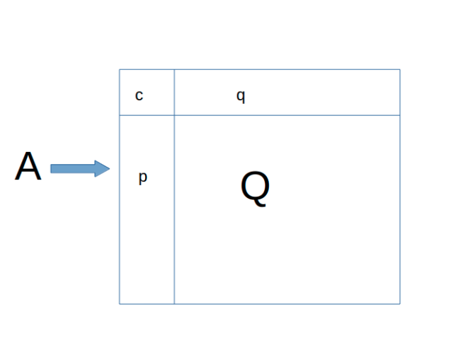

## File introduce 

* opnp.py is an simple implementation of `OPnP` algorithm 
* see [OPnP](http://www2.maths.lth.se/vision/publdb/reports/pdf/zheng-kuang-etal-iiccvi-13.pdf)

## Matrices

* `A`: an 11x11 information matrix, w.r.t `M` in the paper 
* `V`: and 11x1 parameter matrix, w.r.t `$\alpha$` in the paper

> see: 

